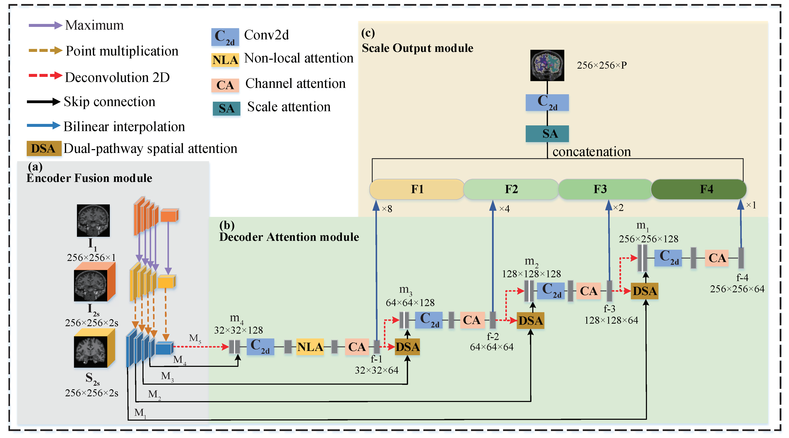

## CAN: Context-assisted full Attention Network for brain tissue segmentation

by Zhan Li, Chunxia Zhang, Yongqin Zhang, Xiaofeng Wang, Xiaolong Ma, Hai Zhang, Songdi Wu

* **SAIL (Statistic Analysis And Intelligent Learning) Group of NWU**

* We provide related codes and configuration files to reproduce the "CAN: Context-assisted full Attention Network for brain tissue segmentation"

## Introduction
Our paper propose a new method named CAN for brain tissue segmentation, which takes full advantage of the skull images to constraint the brain region and fuse 2D and 3D data in MRI.

<div align="center">
  
</div>


## Citation
```
@article{li2022can,
  title={CAN: Context-assisted full Attention Network for brain tissue segmentation},
  author={Li, Zhan and Zhang, Chunxia and Zhang, Yongqin and Wang, Xiaofeng and Ma, Xiaolong and Zhang, Hai and Wu, Songdi},
  journal={Medical Image Analysis},
  pages={102710},
  year={2022},
  publisher={Elsevier}
}
```

## Train
Enter python train.py to run the code. If you are prompted for no packages, enter pip install * * to install dependent packages

## Inference
After training, you can use the command test.py to validate your model.

## Pre-trained Model
The pre-trained model files on Dhcp and MALC are saved in save_model directory. 

